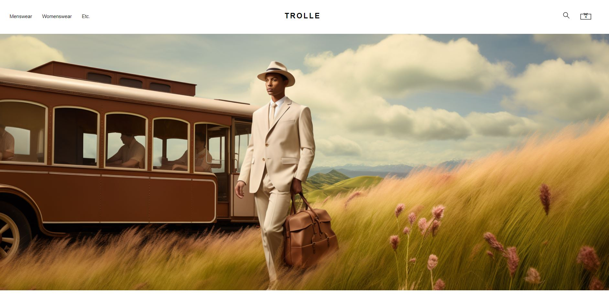
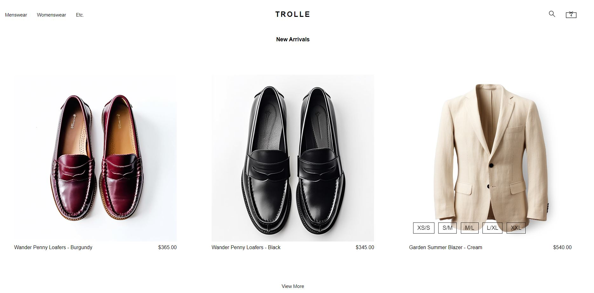

# Trolle Fashion Ecommerce

Trolle is a ecommerce project that showcases the integration of user JWT authentication, dynamic product loading from a database, search & filtering techniques, a graphQL microservice implementation and a simple yet effective user interface to demonstrate the connection between the frontend and the robust backend.

In order to showcase my frontend skiils the entire site is directly inspired by the Bode New York Website: 

## Screenshots

### Desktop

## Technology Used

The project utilizes the following technologies:

- React
- Typescript
- Redux
- Axios
- Java
- Spring Boot
- Spring Security
- GraphQL
- MySql

Feel free to explore the project, and don't hesitate to reach out if you have any questions or feedback.
